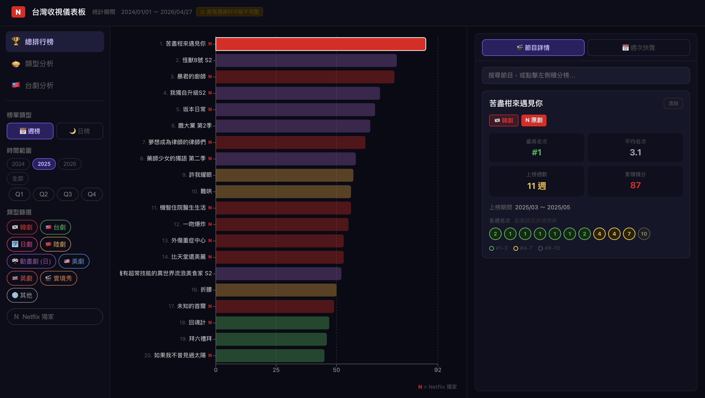
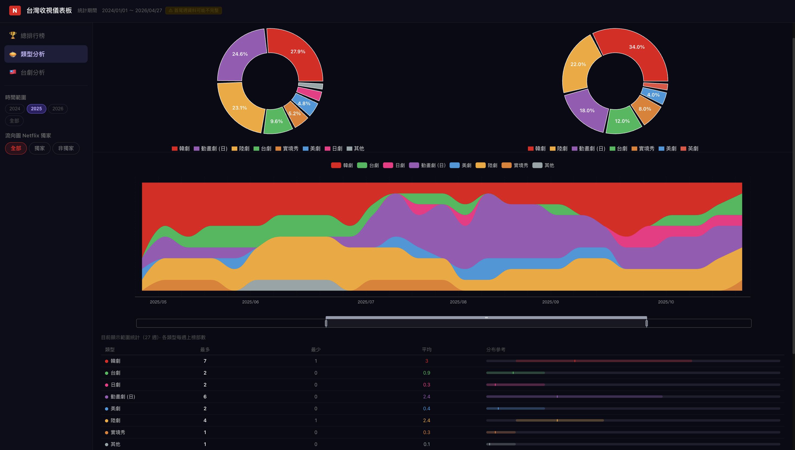
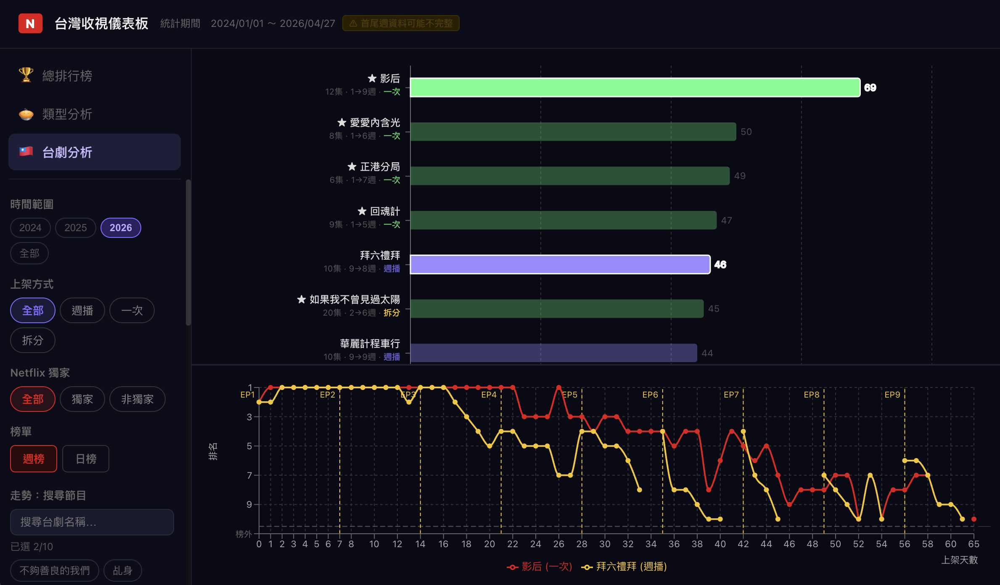

# Netflix Taiwan Rankings Dashboard

A data visualization dashboard that transforms Netflix Taiwan Facebook ranking posts into a structured Excel/JSON data pipeline and an interactive React dashboard.

**Live Demo:** https://jinfer68.github.io/netflix-taiwan-dashboard/  
**Repository:** https://github.com/jinfer68/netflix-taiwan-dashboard

---

## Overview

Netflix Taiwan publishes weekly ranking information through Facebook posts, but the data is not available as a structured historical dataset.

This project builds an end-to-end data pipeline that collects ranking posts, cleans and maintains the data in an Excel-based local database, converts it into JSON, and visualizes the results through an interactive dashboard.

The goal is not only to display rankings, but to turn scattered social media posts into a maintainable data product for exploring Taiwan streaming trends.

---

## Highlights

- Collected and structured Netflix Taiwan ranking data from **2024/01/01 to 2026/04/27**
- Covered **119 weeks** of ranking history
- Tracked **314 shows** and **80+ Taiwanese dramas**
- Built an Excel-based local database for manual validation and metadata maintenance
- Converted cleaned Excel data into structured JSON for frontend use
- Developed a React + TypeScript dashboard with rankings, genre analysis, and Taiwanese drama comparison

---

## Screenshots

> Add dashboard screenshots to `docs/screenshots/` using the filenames below. Once the images are uploaded, they will appear here automatically.

### Overall Rankings



### Genre Analysis



### Taiwanese Drama Analysis



---

## Tech Stack

### Data Pipeline

- Python
- Selenium
- Excel / xlsx
- JSON

### Frontend

- React 18
- TypeScript
- Vite
- Recharts
- ECharts

---

## Data Pipeline

```text
Netflix Taiwan Facebook Posts
        ↓
Python Scraper
        ↓
Excel Local Database
        ↓
JSON Conversion
        ↓
React + TypeScript Dashboard
```

### Why Excel?

This project intentionally uses Excel as a lightweight local database because some metadata, such as release type, Netflix Original status, and episode count, requires manual validation. Excel keeps the data easy to inspect and edit while still allowing the frontend to consume a structured JSON output.

---

## Dashboard Features

### Overall Rankings

- Weekly and daily ranking modes
- Year, quarter, month, and week filters
- Genre filters
- Netflix Original filter
- Top 20 ranking chart
- Show quick lookup panel

### Genre Analysis

- Genre distribution charts
- Weekly genre flow visualization
- Netflix Original / non-original filtering

### Taiwanese Drama Analysis

- Taiwanese drama ranking table
- Weekly score and daily score comparison
- Release type filters
- Multi-show ranking trend comparison based on days after release

---

## Scoring Logic

The dashboard converts ranking positions into points so shows can be compared across different time windows.

```text
Rank 1  → 10 points
Rank 2  → 9 points
Rank 3  → 8 points
...
Rank 10 → 1 point
```

This makes it possible to compare shows across weeks, months, quarters, and years instead of only showing a single weekly ranking.

---

## My Role

I designed the overall data workflow, Excel database schema, data cleaning rules, field standardization logic, dashboard requirements, and analysis structure.

I used Claude Code as an AI coding assistant to accelerate implementation, while I was responsible for requirement definition, data structure design, validation, and final integration.

---

## Project Structure

```text
netflix-taiwan-dashboard/
├── public/
│   └── data/
│       └── rankings.json
├── src/
│   ├── components/
│   │   ├── charts/
│   │   └── layout/
│   ├── constants/
│   ├── types/
│   ├── utils/
│   └── App.tsx
├── package.json
└── vite.config.ts
```

---

## Getting Started

### Install dependencies

```bash
npm install
```

### Start the development server

```bash
npm run dev
```

### Build for production

```bash
npm run build
```

---

## Future Improvements

- Add movie ranking analysis
- Add GitHub Actions for automatic weekly updates
- Add CSV export for filtered results
- Improve responsive layout for mobile devices
- Expand show-level historical lookup

---

## Notes

The ranking data is based on publicly available Netflix Taiwan Facebook posts and is used for learning, research, and portfolio demonstration purposes only.
